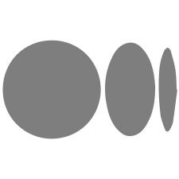

# Hi, I'm Yash 👋 

---

## JavaScript | Web3 | Open Source | Developer Relations

### About Me

I'm an accomplished **Developer Relations leader** and a seasoned **JavaScript developer**, specializing in **Web3 technologies** and **open source ecosystems**. With years of experience building and nurturing developer ecosystems, I specialize in bridging the gap between complex technologies and developer-friendly solutions.

---

### 🌐 Connect with Me

    
    
    
    

---

### 📚 Learn More About Me

Check out my [website](https://yashovardhan.dev) to explore my work, blogs, and more!
